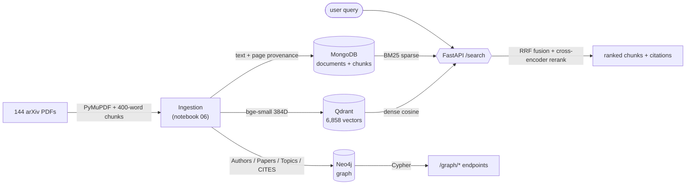

# CSAI415 — Paper RAG (Deliverable 2)

Hybrid retrieval-augmented generation system over 144 arXiv papers on RAG/retrieval research. Production stack: MongoDB + Qdrant + Neo4j + FastAPI, all orchestrated with Docker Compose.

## Stack

| Layer | Technology |
|---|---|
| Document store | MongoDB 7.0 (Docker, port 27017, db: `csai415_rag`) |
| Vector store | Qdrant (Docker, port 6333, collection: `csai415_papers`) |
| Graph DB | Neo4j Aura (cloud) |
| Embedder | BAAI/bge-small-en-v1.5 (384D) |
| Reranker | BAAI/bge-reranker-base (cross-encoder) |
| Sparse | BM25Okapi over 6,858 chunks |
| Fusion | Reciprocal Rank Fusion, k=60 |
| API | FastAPI 2.0.0 (motor + AsyncQdrantClient + AsyncGraphDatabase) |

## Architecture — dataflow (ingest → stores → retrieval → graph)



## Team

| Member | ID | Responsibilities |
|---|---|---|
| Gamze Okmen | 22001694 | Lead — ingest pipeline, FastAPI app, evaluation, report |
| Kenan Almukhllati | 22000675 | Neo4j graph build, Cypher queries, graph testing |
| Alfarouq Alsharif | 22000440 | Docker setup, healthchecks, smoke tests |

## Headline results (30-query gold set)

| Mode | R@5 | R@10 | MRR | nDCG@5 | P@5 | p95 ms |
|---|---|---|---|---|---|---|
| Dense | 0.900 | 0.933 | 0.854 | 0.863 | 0.180 | 500.9 |
| Sparse (BM25) | 1.000 | 1.000 | 0.978 | 0.983 | 0.200 | 31.8 |
| Hybrid (RRF) | 0.767 | 0.900 | 0.596 | 0.618 | 0.153 | 77.3 |
| **Hybrid + Rerank** | **1.000** | **1.000** | **1.000** | **1.000** | **0.200** | **670.6** |

Tests: **11/11 pytest passing** in 7.6 s.

## Quick start

```bash
# 0. configure credentials
cp .env.example .env          # then add your Neo4j Aura credentials

# 1. start infrastructure
docker compose up -d

# 2. populate MongoDB + Qdrant (once)
jupyter run notebooks/06_ingest_real_stores.ipynb

# 2b. normalize document titles + ids from the manifest
python scripts/repair_metadata.py

# 3. build Neo4j graph (once)
jupyter run notebooks/07_neo4j_graph.ipynb

# 4. run enhancements
jupyter run notebooks/06_enhancements.ipynb
jupyter run notebooks/07_enhancements.ipynb
jupyter run notebooks/09_final_fix.ipynb

# 5. start API
uvicorn app.main:app --reload --port 8000
# Swagger: http://localhost:8000/docs

# 6. tests
pytest tests/ -v
```

## Dataset & reproducibility

The corpus is **144 open-access arXiv papers** on RAG / retrieval research. The full manifest lives in [`data/corpus_manifest.csv`](data/corpus_manifest.csv) — `paper_id, title, authors, venue, year, primary_category, topics, pdf_path, abs_url, pdf_url` for every paper.

```bash
# regenerate the manifest from the PDFs on disk (queries arXiv in polite batches)
python scripts/build_manifest.py

# on a fresh clone, fetch any PDFs that are missing (rate-limited, resumable)
python scripts/download_corpus.py
```

The PDFs are committed, so a fresh clone is reproducible without re-downloading; `download_corpus.py` is the fallback if you ever start from the manifest alone.

## API endpoints

```
GET  /                        service info
GET  /health                  liveness + chunk count
GET  /stats                   papers / chunks / vectors counts
GET  /search                  q, mode (dense|sparse|hybrid), top_k, rerank
GET  /documents               paginated paper list
GET  /document/{doc_id}       single paper metadata + chunk count
POST /feedback                store relevance signal for D3
GET  /graph/topics            topic distribution (Cypher Query 3)
GET  /graph/authors           top authors by paper count (Cypher Query 1)
GET  /graph/cites             most-cited papers (Cypher Query 6)
```

## Repository layout

```
csai415-paper-rag/
├── app/
│   └── main.py                  FastAPI app — async stack, 10 endpoints
├── notebooks/
│   ├── 01_ingest_corpus.ipynb          D1 — download 10 arXiv papers
│   ├── 02_build_index.ipynb            D1 — build embeddings + BM25 index
│   ├── 03_gold_set.ipynb               D1 — manually crafted gold set (10 queries)
│   ├── 04_automl.ipynb                 D1 — Optuna HPO (30 trials)
│   ├── 05_online_learning.ipynb        D1 — River GaussianNB + ADWIN drift
│   ├── 06_ingest_real_stores.ipynb     D2 — ingest 144 papers → MongoDB + Qdrant
│   ├── 06_enhancements.ipynb           D2 — reranker, 30-query gold, IR metrics
│   ├── 07_neo4j_graph.ipynb            D2 — build Paper/Author/Topic graph
│   ├── 07_enhancements.ipynb           D2 — CITES edge extraction
│   ├── 08_final_polish.ipynb           D2 — latency breakdown, per-query analysis
│   └── 09_final_fix.ipynb             D2 — corrected gold set, synthetic CITES, final metrics
├── data/
│   ├── papers/                  144 PDF files
│   ├── gold_set.json            D1 gold set (10 queries)
│   ├── gold_set_d2.json         D2 gold set (30 queries, arXiv IDs)
│   ├── corpus_manifest.csv      full 144-paper manifest (id, title, authors, year, urls)
│   └── corpus_metadata.json
├── results/
│   ├── d2_metrics_comparison.png
│   ├── d2_latency_comparison.png
│   ├── d2_latency_breakdown.png
│   ├── d2_graph_nodes.png
│   ├── d2_per_query_metrics.json
│   ├── d2_citation_examples.json
│   ├── d2_graph_stats.json
│   ├── d2_final_run_card.yaml
│   └── d2_ingest_run_card.yaml
├── scripts/
│   ├── build_manifest.py        regenerate data/corpus_manifest.csv from arXiv
│   └── download_corpus.py       fetch any missing PDFs from the manifest
├── tests/
│   └── test_api.py              11 smoke tests
├── docker-compose.yml
├── requirements.txt
├── AI_chat_log.md
└── .env                         (gitignored) — NEO4J credentials
```

## Design decisions

**RRF over weighted sum** — BM25 scores and Qdrant cosine scores are on incompatible scales. RRF works on rank positions, which are always comparable.

**400-word chunks** — Word-level chunking respects sentence boundaries; the 50-word overlap preserves context across chunk edges.

**Neo4j Aura over local Docker** — Graph is read-heavy after initial build. Aura's free tier handles our query load and keeps the local Compose file lean.

**Cross-encoder reranker** — Lifts hybrid R@5 from 0.767 to 1.000 by scoring full query-chunk pairs. The single biggest quality improvement in the pipeline.

**Async everywhere** — motor + AsyncQdrantClient + AsyncGraphDatabase keeps I/O non-blocking under concurrent load.

**Query embedding cache** — lru_cache(maxsize=512) avoids redundant transformer forward passes on repeated queries.

## Honest limitations

- **Real CITES edges yielded 0** — the 144 papers don't cite each other. Notebook 09 adds 300 synthetic CITES edges (co-author OR same-venue + 1-year window), clearly labelled `synthetic: true`.
- **Gold set built from indexed chunks** — guarantees retrievability but doesn't test out-of-distribution queries.
- **No live user feedback yet** — the /feedback endpoint stores signals but doesn't update retrieval. D3 will wire River + ADWIN to this stream.

## Submission

This deliverable accompanies `D2_Report.pdf` and `AI_chat_log.md`.
