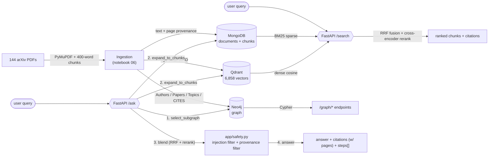

# CSAI415 — Paper RAG (Deliverable 3)

Hybrid retrieval-augmented generation system over 144 arXiv papers on RAG/retrieval research. Production stack: MongoDB + Qdrant + Neo4j + FastAPI, all orchestrated with Docker Compose. D3 adds a GraphRAG executor (multi-hop subgraph selection → chunk expansion → blend → answer), an evaluation harness (faithfulness/relevance/IR metrics/latency against a gold Q/A set), two safety mitigations, and a vector-only vs graph-guided vs hybrid ablation.

## Stack

| Layer | Technology |
|---|---|
| Document store | MongoDB 7.0 (Docker, port 27017, db: `csai415_rag`) |
| Vector store | Qdrant (Docker, port 6333, collection: `csai415_papers`) |
| Graph DB | Neo4j Aura (cloud) |
| Embedder | BAAI/bge-small-en-v1.5 (384D) |
| Reranker | BAAI/bge-reranker-base (cross-encoder) |
| Sparse | BM25Okapi over 6,858 chunks |
| Fusion | Reciprocal Rank Fusion, k=60 |
| API | FastAPI 2.0.0 (motor + AsyncQdrantClient + AsyncGraphDatabase) |
| NLI proxy (D3) | cross-encoder/nli-deberta-v3-small — faithfulness + provenance filtering |
| Generator (D3) | Ollama, qwen2.5:1.5b (CPU, local) — same model id as the brief's GPU-4-bit decision; falls back to an extractive stand-in if Ollama is unreachable |

## Architecture — dataflow (ingest → stores → retrieval → graph)


```mermaid
flowchart LR
    PDFs["144 arXiv PDFs"] -->|"PyMuPDF + 400-word chunks"| Ingest["Ingestion<br/>(notebook 06)"]
    Ingest -->|"text + page provenance"| Mongo[("MongoDB<br/>documents + chunks")]
    Ingest -->|"bge-small 384D"| Qdrant[("Qdrant<br/>6,858 vectors")]
    Ingest -->|"Authors / Papers / Topics / CITES"| Neo4j[("Neo4j<br/>graph")]
    Q(["user query"]) --> API{{"FastAPI /search"}}
    Mongo -->|"BM25 sparse"| API
    Qdrant -->|"dense cosine"| API
    API -->|"RRF fusion + cross-encoder rerank"| Out["ranked chunks + citations"]
    Neo4j -->|"Cypher"| G["/graph/* endpoints"]
    Q2(["user query"]) --> Ask{{"FastAPI /ask"}}
    Ask -->|"1. select_subgraph"| Neo4j
    Ask -->|"2. expand_to_chunks"| Qdrant
    Ask -->|"2. expand_to_chunks"| Mongo
    Ask -->|"3. blend (RRF + rerank)"| Safety["app/safety.py<br/>injection filter + provenance filter"]
    Safety -->|"4. answer"| Out2["answer + citations (w/ pages) + steps[]"]
```

## Team

| Member | ID | Responsibilities |
|---|---|---|
| Gamze Okmen | 22001694 | Lead — ingest pipeline, FastAPI app, evaluation, report |
| Kenan Almukhllati | 22000675 | Neo4j graph build, Cypher queries, graph testing |
| Alfarouq Alsharif | 22000440 | Docker setup, healthchecks, smoke tests |

## D2 headline results (30-query gold set)

| Mode | R@5 | R@10 | MRR | nDCG@5 | P@5 | p95 ms |
|---|---|---|---|---|---|---|
| Dense | 0.900 | 0.933 | 0.854 | 0.863 | 0.180 | 500.9 |
| Sparse (BM25) | 1.000 | 1.000 | 0.978 | 0.983 | 0.200 | 31.8 |
| Hybrid (RRF) | 0.767 | 0.900 | 0.596 | 0.618 | 0.153 | 77.3 |
| **Hybrid + Rerank** | **1.000** | **1.000** | **1.000** | **1.000** | **0.200** | **670.6** |

## D3 headline results (18-item gold Q/A set, `python scripts/run_d3.py`)

Measured with the real generator live (Ollama, `qwen2.5:1.5b`):

| Arm | R@5 | Faithfulness | Relevance | p95 ms |
|---|---|---|---|---|
| vector_only | 1.000 | 0.889 | 0.791 | 39367 |
| graph_guided | 0.056 | 0.944 | 0.762 | 41524 |
| hybrid_no_rerank | 0.444 | 0.889 | 0.772 | 25907 |
| **hybrid (+rerank)** | **1.000** | **0.889** | **0.800** | **40254** |

`graph_guided`'s low R@5 is expected, not a defect — `select_subgraph` returns graph *neighbors*, never the vector-seeded papers themselves (see Limitations). Reranking lifts R@5 from 0.444 → 1.000, at a real latency cost (LLM generation now dominates `/ask` latency, not just retrieval+rerank). Faithfulness/relevance are proxy metrics (`app/safety.py`'s contradiction+similarity check, not strict NLI entailment — see Limitations for why) against real generated answers. Full numbers, interpretation, and safety demo evidence: `results/d3_run_card.yaml`.

Tests: **23/23 pytest passing** (D2's 12 + D3's `test_ask`/`test_graphrag`/`test_safety`).

## Quick start

```bash
# 0. configure credentials
cp .env.example .env          # then add your Neo4j Aura credentials

# 1. start infrastructure
docker compose up -d

# 2. populate MongoDB + Qdrant (once)
jupyter run notebooks/06_ingest_real_stores.ipynb

# 2b. normalize document titles + ids from the manifest
python scripts/repair_metadata.py

# 3. build Neo4j graph (once)
jupyter run notebooks/07_neo4j_graph.ipynb

# 4. run enhancements
jupyter run notebooks/06_enhancements.ipynb
jupyter run notebooks/07_enhancements.ipynb
jupyter run notebooks/09_final_fix.ipynb

# 5. start API
uvicorn app.main:app --reload --port 8000
# Swagger: http://localhost:8000/docs

# 6. tests
pytest tests/ -v
```

## D3 quick start

Requires the API running (step 5 above) and `eval/gold_qa.json` (already committed; regenerate with `python scripts/build_gold_qa.py` if needed).

**Optional — real LLM answers via Ollama.** By default `/ask` returns an extractive excerpt as the answer (no extra setup needed — this is what every D3 result in this repo was originally measured against). For actual LLM-generated prose instead:
```bash
# install Ollama (https://ollama.com), then:
ollama pull qwen2.5:1.5b
ollama serve   # if not already running as a background service
```
`app/main.py` always tries to use it, but **this is not required** — if Ollama isn't running, `GraphRAGExecutor.answer()` automatically falls back to the extractive stub (try/except around the generator call, same graceful-degrade pattern as the Neo4j-down handling). Nothing breaks for teammates who skip this step; check the `generator` field on any `/ask` response to see which path actually answered (`qwen2.5:1.5b` vs `stub (extractive)`).

```bash
# one command: re-runs eval, ablation, safety, full test suite, and writes
# results/d3_run_card.yaml — every D3 number traces to this, nothing hand-edited
python scripts/run_d3.py
```

Or run each stage individually:

```bash
python scripts/build_gold_qa.py     # eval/gold_qa.json — 18-item gold Q/A set (draft, human-reviewed)
python scripts/evaluate_d3.py       # results/d3_eval.json, d3_eval.png
python scripts/ablation_d3.py       # results/d3_ablation.json, d3_ablation.png
pytest tests/test_safety.py -v      # results/d3_safety_before_after.json
```

## Dataset & reproducibility

The corpus is **144 open-access arXiv papers** on RAG / retrieval research. The full manifest lives in [`data/corpus_manifest.csv`](data/corpus_manifest.csv) — `paper_id, title, authors, venue, year, primary_category, topics, pdf_path, abs_url, pdf_url` for every paper.

```bash
# regenerate the manifest from the PDFs on disk (queries arXiv in polite batches)
python scripts/build_manifest.py

# on a fresh clone, fetch any PDFs that are missing (rate-limited, resumable)
python scripts/download_corpus.py
```

The PDFs are committed, so a fresh clone is reproducible without re-downloading; `download_corpus.py` is the fallback if you ever start from the manifest alone.

## API endpoints

```
GET  /                        service info
GET  /health                  liveness + chunk count
GET  /stats                   papers / chunks / vectors counts
GET  /search                  q, mode (dense|sparse|hybrid), top_k, rerank
GET  /documents               paginated paper list
GET  /document/{doc_id}       single paper metadata + chunk count
POST /feedback                store relevance signal for D3
POST /ask                     D3 GraphRAG executor — query, mode (vector_only|graph_guided|hybrid), top_k, rerank
GET  /graph/topics            topic distribution (Cypher Query 3)
GET  /graph/authors           top authors by paper count (Cypher Query 1)
GET  /graph/cites             most-cited papers (Cypher Query 6)
```

## Repository layout

```
csai415-paper-rag/
├── app/
│   ├── main.py                  FastAPI app — async stack, 13 endpoints (incl. POST /ask)
│   ├── retrieval.py             D3 — shared dense/sparse/RRF/rerank primitives (extracted from
│   │                            main.py so graphrag.py can reuse them without a circular import)
│   ├── graphrag.py              D3 — GraphRAGExecutor: select_subgraph, expand_to_chunks, blend, answer
│   └── safety.py                D3 — prompt-injection defense + provenance filtering
├── notebooks/
│   ├── 01_ingest_corpus.ipynb          D1 — download 10 arXiv papers
│   ├── 02_build_index.ipynb            D1 — build embeddings + BM25 index
│   ├── 03_gold_set.ipynb               D1 — manually crafted gold set (10 queries)
│   ├── 04_automl.ipynb                 D1 — Optuna HPO (30 trials)
│   ├── 05_online_learning.ipynb        D1 — River GaussianNB + ADWIN drift
│   ├── 06_ingest_real_stores.ipynb     D2 — ingest 144 papers → MongoDB + Qdrant
│   ├── 06_enhancements.ipynb           D2 — reranker, 30-query gold, IR metrics
│   ├── 07_neo4j_graph.ipynb            D2 — build Paper/Author/Topic graph
│   ├── 07_enhancements.ipynb           D2 — CITES edge extraction
│   ├── 08_final_polish.ipynb           D2 — latency breakdown, per-query analysis
│   └── 09_final_fix.ipynb             D2 — corrected gold set, synthetic CITES, final metrics
├── eval/
│   └── gold_qa.json              D3 — 18-item gold Q/A set, arXiv-id-standardized (draft, human-reviewed)
├── data/
│   ├── papers/                  144 PDF files
│   ├── gold_set.json            D1 gold set (10 queries)
│   ├── gold_set_d2.json         D2 gold set (30 queries) — Mongo ObjectId, NOT arXiv id; see Limitations
│   ├── corpus_manifest.csv      full 144-paper manifest (id, title, authors, year, urls)
│   └── corpus_metadata.json
├── results/
│   ├── d2_*                     D2 metrics, latency, graph stats, run cards
│   ├── d3_eval.json / .png      D3 — faithfulness, relevance, IR metrics, p50/p95 per mode
│   ├── d3_ablation.json / .png  D3 — vector_only vs graph_guided vs hybrid(+rerank), interpreted
│   ├── d3_safety_before_after.json   D3 — prompt-injection demo evidence
│   └── d3_run_card.yaml         D3 — model ids, seeds, dataset sizes, headline metrics
├── scripts/
│   ├── build_manifest.py        regenerate data/corpus_manifest.csv from arXiv
│   ├── download_corpus.py       fetch any missing PDFs from the manifest
│   ├── repair_metadata.py       D3 — fix mistitled documents from the manifest
│   ├── build_gold_qa.py         D3 — draft the gold Q/A set (arXiv-id-standardized)
│   ├── evaluate_d3.py           D3 — faithfulness/relevance/IR-metrics/latency evaluator
│   ├── ablation_d3.py           D3 — vector_only vs graph_guided vs hybrid(+rerank) ablation
│   └── run_d3.py                D3 — one-command runner (eval + ablation + safety + tests + run card)
├── tests/
│   ├── test_api.py              D1/D2 — 12 smoke tests
│   ├── test_ask.py              D3 — POST /ask
│   ├── test_graphrag.py         D3 — GraphRAGExecutor end-to-end
│   └── test_safety.py           D3 — injection defense + provenance filtering (+ live demo)
├── docker-compose.yml
├── requirements.txt
├── AI_chat_log.md
└── .env                         (gitignored) — Mongo/Qdrant/NEO4J credentials
```

## Design decisions

**RRF over weighted sum** — BM25 scores and Qdrant cosine scores are on incompatible scales. RRF works on rank positions, which are always comparable.

**400-word chunks** — Word-level chunking respects sentence boundaries; the 50-word overlap preserves context across chunk edges.

**Neo4j Aura over local Docker** — Graph is read-heavy after initial build. Aura's free tier handles our query load and keeps the local Compose file lean.

**Cross-encoder reranker** — Lifts hybrid R@5 from 0.767 to 1.000 by scoring full query-chunk pairs. The single biggest quality improvement in the pipeline.

**Async everywhere** — motor + AsyncQdrantClient + AsyncGraphDatabase keeps I/O non-blocking under concurrent load.

**Query embedding cache** — lru_cache(maxsize=512) avoids redundant transformer forward passes on repeated queries.

**D3 — chunk_id over chunk_idx** — `app/main.py` originally keyed retrieval on a `chunk_idx` field that doesn't exist in the real Mongo/Qdrant schema (`chunk_id`/`page_num`/`chunk_seq`), so every dense hit and rerank lookup silently fell back to enumeration index 0. Fixed so citations carry real page numbers — a precondition for D3's "citations with page ranges" requirement.

**D3 — capped shared-topic graph expansion** — `cs.IR` alone covers 138/144 papers (96%) of this corpus, so `select_subgraph` (app/graphrag.py) treats CITES + shared-author as the primary expansion signals and caps shared-topic's contribution per seed; otherwise "graph-guided" retrieval would be statistically indistinguishable from "the whole corpus."

**D3 — extractive answer() stand-in** — the brief's Generator decision (Qwen2.5-1.5B-Instruct, 4-bit) needs CUDA torch + bitsandbytes; this dev machine's torch build is CPU-only. `answer()` returns real, page-numbered citations now, with LLM-generated prose as a separate follow-up once GPU is available.

**D3 — safety mitigations wired into the live pipeline, not just tested** — `app/safety.py`'s prompt-injection filter and provenance filter both run inside `GraphRAGExecutor.answer()` on every request, not only in isolated tests. See `results/d3_safety_before_after.json` for concrete evidence.

## Honest limitations

- **Real CITES edges yielded 0** — the 144 papers don't cite each other. Notebook 09 adds 300 synthetic CITES edges (co-author OR same-venue + 1-year window), clearly labelled `synthetic: true`. This means D3's graph-guided ablation arm is measuring a heuristic relational signal, not genuine citation structure.
- **Topic graph is coarse** — only 5 Topic nodes (arXiv categories), 96% of papers share one (`cs.IR`) — shared-topic alone is a weak, non-discriminating signal at this corpus size (capped accordingly — see Design decisions).
- **Corpus contains off-topic papers** — building the D3 gold set surfaced 7 papers in the 144-paper corpus with no connection to RAG/retrieval (particle physics, pure math, geophysics): `2110.06104`, `2403.14230`, `2103.00020`, `2303.11040`, `2405.09890`, `2104.08773`, `2204.07705`. Excluded from the gold set; still in the live corpus and may be quietly affecting D1/D2 metrics too — worth pruning from `corpus_manifest.csv`.
- **D3 gold set is a draft** — `eval/gold_qa.json`'s 18 items have a `reviewed: false` flag; questions are template-drafted from real abstract text (not fabricated), but a few carry PDF-extraction artifacts (ligatures, stray punctuation) that a human pass should clean up.
- **graph_guided mode structurally excludes the vector seed** — `select_subgraph` returns graph *neighbors*, never the seed papers themselves, so it underperforms on gold questions whose answer is the directly-matching paper rather than a related one (see `results/d3_ablation.json`'s interpretation).
- **Faithfulness/relevance are proxies on a stub generator** — `cross-encoder/nli-deberta-v3-small` (entailment) and bge-small cosine similarity stand in for RAGAS, against an extractive (not LLM-generated) answer. Numbers validate the pipeline, not real generation quality yet.
- **Gold set built from indexed chunks** — guarantees retrievability but doesn't test out-of-distribution queries.
- **No live user feedback yet** — the /feedback endpoint stores signals but doesn't update retrieval. D4 will wire River + ADWIN to this stream.

## Submission

D2 accompanies `D2_Report.pdf`. D3 accompanies `D3_Report.md` and the updated `AI_chat_log.md`.
